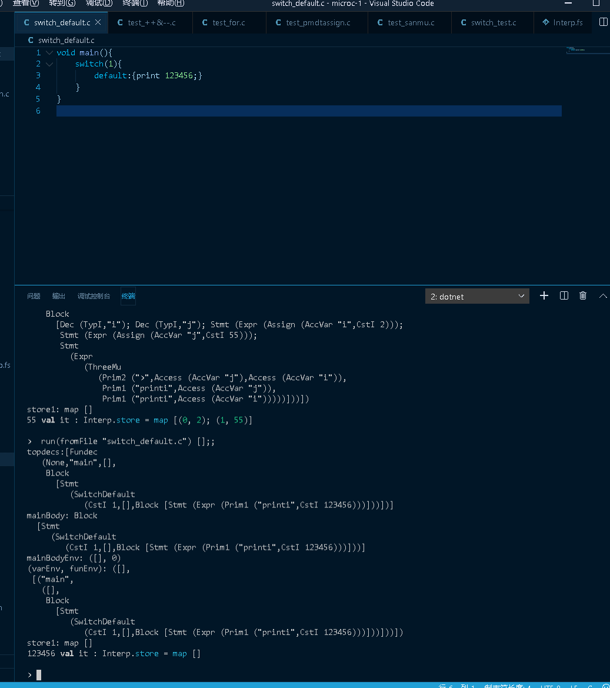

# 					2019-2020学年第1学期

##  实 验 报 告

- 课程名称: 编程语言原理与编译
- 实验项目: <u>MicroC编译器（大作业）</u>
- 专业班级：<u>计算机1703</u>
- 学生学号：<u>31701072</u>
- 学生姓名：<u>黄晨觉</u>
- 实验指导教室：<u>郭鸣</u>

## Github链接

git:https://github.com/wakerh1/Compiler

## 功能点

- 编译并使用javaMachine运行

- 类型
  - bool
  - int
  - void
- 操作符
  - 算术操作符
    - +
    - -
    - *
    - /
    - -
    - ++
    - --
  - 逻辑运算符
    - <
    - ＞
    - ==
    - !=
    - <=
    - ≥
    - &&
    - ||
    - !
  - 赋值运算符
    - +=
    - -=
    - /=
    - *=
    - %=
  - 循环
    - for
    - while
  - 选择
    - if
    - else
    - switch
    - switch default

## 测试程序部分

#### ex1.c

#### ex2.c

#### ex3.c

#### ex4.c

#### test_for.c

#### test_++&--.c

#### switch_test.c

#### switch_default.c

## 编译结果

#### 生成 swtich_test.out  测试switch没有default版本的

#### 生成 test_plusp.out  测试++a&--a的功能

#### 生成 test_bplusa.out(对应test_b=++a.c)   测试++a实现

#### 生成 test_pmdtassign.out  测试+=等

#### 生成test_for.out 测试for循环

## 运行结果

#### switch_test.c

#### test_++&--.c

#### test_for.c

#### test_pmdtassign.c

#### test_sanmu.c

#### swtich_default.c

## 自我评价

主要完成的部分是语法变化，对于语义部分进行过了尝试，但无法解决错误问题，没有实现。

本学期因为设置了大作业的课程较多，且对编译原理这门课难度的畏惧，使我这门课的学习成果不佳，大作业着手于语法的修改，添加大作业改进列表中的一些功能;自我评价来说，我实现的主要是语法部分和解释器还有编译器，可以使用java machine 运行生成的.out文件.

| 功能           | 示例               | 对应文件                  | 自评 |
| -------------- | ------------------ | ------------------------- | ---- |
| 自增、自减     | ++i,--i,i--,i++;   | test_++&--.c,test_b=++a.c | 4    |
| 三目运算符     | e1?e2:e3           | test_sanmu.c              | 4    |
| switch         | switch(i){case 1:} | switch_test.c             | 5    |
| switch default | switch(i){default} | switch_default.c          | 4    |
| 赋值运算符     | +=,-=,%=,/=,*=     | test_pmdtassign.c         | 4    |
| For循环        | for(i=1;i<5;i++)   | test_for.c                | 4    |

## 课程建议

- 编译原理课程的内容其实开始明白部分后看起来就越来越有兴趣，就是教材所用语言和课程所需要学习的Ocaml和F#不太一样。
- 老师可以试着更早地和同学们说明期末大作业的要求，也可以提供一份示例的报告(删去代码相关的部分)，只有功能点的介绍之类的

## 心得体会

- 在一开始编写编译原理作业时，有一种什么都看不懂的感觉，但在仔细看了几遍老师的文档和注释后，就发现大部分内容是可以看明白些了，然后抱着看明白点的想法去尝试编写时还是遇到了很多问题，新的功能的词法定义，语法的定义，token的添加和优先级%left，%right，%nonoassoc的不同，左结合、右结合、不结合的不同；还有修改编译时的一次次尝试，查阅相关的机器码指令，都是自己之前从未好好接触过的。

- 编写for循环的时候一开始遇到了很多困难，学着while写还是有很多错误，后来不断修改和尝试，终于成功完成了for循环的词法分析、语法分析和解释，在有了for循环的成功后，之后赋值运算符顺利了许多

- switch的实现花了比较久，因为一开始没想到要把case加入到一个列表中来实现，后来在同学提醒下才想到可以这么解决；但是break的问题一直搞不定，就只能通过其他的方式来模拟break的实现。

- 编译部分的实现一开始根本没有头绪，不知道怎么把机器指令结合起来，还有@符号的拼接是什么效果。翻了几遍文档和尝试多次后大概能照着while实现for循环的编译，但switch的编译困扰了自己很久，发现看汇编的代码也是一种启发自己的方式,最后照着汇编的代码画了一下大概的流程图然后完成了switch。

- 而在命令式语言中，要修改**内存**中变量的值，就必须要实现**存储模型**，简单的存储模型将变量名映射到整数值，并将存储看成运行时的上下文环境。

- 命令式语言和函数式语言不同的有这几点：区分**表达式求值**eval expr 与 **语句执行** exec stmt ；语句执行会修改存储。而且执行过程要求返回**变更的环境**,这也是在模拟命令语言的**内存修改**;命令式语言的变量，默认是**可更改变量**。

- 其中表达式执行不改变store的内容，但执行语句会改变。

  在编译器视线中，也将环境称为符号表。在一个特定的list中，各个元素类型必须统一。

​	    在Mircorc中,有locEnv,gloEnv,Store对解释器的数据进行处理：

  - locEnv 映射局部变量名到地址	gloEnv 映射全局变量到地址store 映射地址到值
    		- locEnv 映射局部变量名到地址	
    - gloEnv 映射全局变量到地址
    - store 映射 地址到值
- 解释是单步执行/求值的，而编译是两步执行/求值
- 了解到栈式虚拟机的优越性和特性：
  - 回避底层细节
  - 跨cpu架构
  - JIT优化
  - JVM/.NET/Python 都采用此方式

- 指令操作数在结果栈上，指令执行表现为——结果栈的状态变化
- 指令在大的分类上可以分为三类：
  - 算术逻辑操作
  - 存储操作
  - 分支转移
- 机器语言代码是线性代码，高级语言有嵌套结构-树状代码
- 编译器的核心任务：从树状结构变换为线性结构；如何用底层的实现细节实现高层的抽象机制
- 虚拟机的当前运行状态共5个，有：
  - p 存放程序
  - pc 程序计数器
  - s 对战，保存变量中间结果
  - sp 堆栈指针
  - bp 基指针，保存当前栈帧开始地址
- 编译器环境：
  - 变量环境varEnv
    - 将全局变量映射到栈上的全局地址
    - 将局部变量映射到活动记录的偏移量
  - 函数环境 funEnv
    - 将函数映射到(label,return type,parameter decs)

- 变量环境varEnv函数环境funEnv起到符号表的作用
- funEnv`编译开始时`makeGlobalEnvs`全局一次性构造完毕，不再发生变化 `makeGlobalEnvs` 同时构造全局变量的变量环境 `varEnv，如果提供对嵌套函数定义的支持，需要在编译时改变函数环境funEnv
- 随着对源代码的编译，当遇到新的变量声明时，varEnv的内容会发生变化。
- 编译器的主要编译函数:
  - cStmt stmt varEnv funEnv : instr list
    - cStmt 编译语句
  - cExpr expr varEnv funEnv : instr list
    - cExpr 编译右值表达式
  -   cAccess expr varEnv funEnv : instr list
    - cAccess 编译左值表达式
  - cProgram topdecs : instr list
    - 建立全局变量环境 函数环境 Build global varEnv and global funEnv
    -  生成全局变量代码 Generate code for global variables
    -  生成调用main的代码 Generate code to call function main
    -  生成所有函数代码 Generate code for all functions, including main

